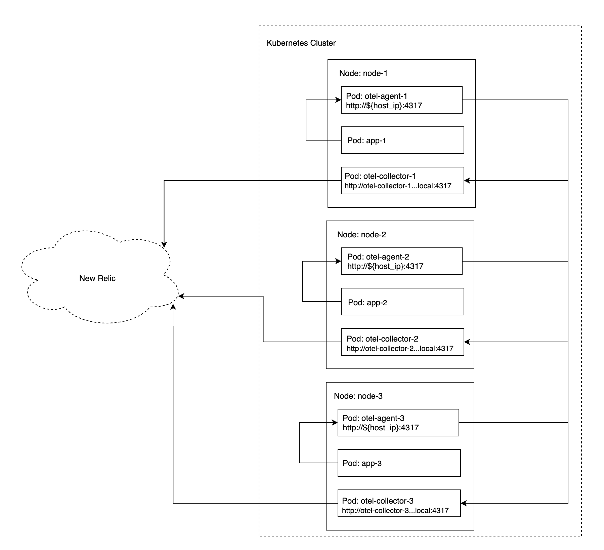

# Kubernetes Collector Tail Based Sampling

## Introduction

This example demonstrates how to use Kubernetes and the OpenTelemetry Collector to do tail based sampling before exporting trace data to New Relic.

The [k8s](./k8s) directory contains manifests for all the components involved. The collector is deployed as an "[agent](./k8s/agent.yaml)" on each node in the cluster with a [DaemonSet](https://kubernetes.io/docs/concepts/workloads/controllers/daemonset/). Application pods send their trace data to the agent running on their same node. Another set of "[collector](./k8s/collector.yaml)" collectors is deployed as a [StatefulSet](https://kubernetes.io/docs/concepts/workloads/controllers/statefulset/), which provides stable hosts for each replica in the set. The agents are configured to use the [load balancing exporter](https://github.com/open-telemetry/opentelemetry-collector-contrib/tree/main/exporter/loadbalancingexporter) with the stable hosts of the collectors, which allows all spans associated with the same trace to be routed to the same collector instance. The collectors are configured to sample the traces with the [tail sampling processor](https://github.com/open-telemetry/opentelemetry-collector-contrib/tree/main/processor/tailsamplingprocessor), and to export traces with the [New Relic exporter](https://github.com/open-telemetry/opentelemetry-collector-contrib/tree/main/exporter/newrelicexporter).

The [otlp-load-generator](../../java/otlp-load-generator) is setup to run as a [Job](https://kubernetes.io/docs/concepts/workloads/controllers/job/) and continuously generates trace data to exercise the setup. 

The following approximately represents diagram approximately represents the setup. Your environment will differ in terms of the number of nodes and the workload.

*Kubernetes Setup*



Other information:
- The [otlp-load-generator.yaml](./k8s/otlp-load-generator.yaml) generates a steady stream of traces that mimic HTTP server requests. It's able to communicate with the agent on the node by injecting the `HOST_IP` via the Kubernetes [downward api](https://kubernetes.io/docs/tasks/inject-data-application/downward-api-volume-expose-pod-information/#capabilities-of-the-downward-api).
- The [collector.yaml](./k8s/collector.yaml) tail sampling processor is configured to only include spans whose `http.status_code` field is >= 400 and <= 1000. The effect is to only include traces with HTTP error status codes. This sampling policy is illustrative, and other sampling policies can be [configured](https://github.com/open-telemetry/opentelemetry-collector-contrib/tree/main/processor/tailsamplingprocessor).
- The [collector.yaml](./k8s/collector.yaml) is configured with 2 replicas. If you change this number, you must also update the `hostnames` configuration in the [agent.yaml](./k8s/agent.yaml).
- Both [agent.yaml](./k8s/agent.yaml) and [collector.yaml](./k8s/collector.yaml) are configured with the [logging exporter](https://github.com/open-telemetry/opentelemetry-collector/tree/main/exporter/loggingexporter) to be able to see the data as it flows.
- All the components are put in namespace called `otel-samples`.

## Run

As configured, this project deploys the [otlp-load-generator](../../otlp-load-generator). If you wish to do the same, you'll need follow the instructions to build the docker image for the load generator, and make it accessible to the kubernetes cluster. The [otlp-load-generator.yaml](./k8s/otlp-load-generator.yaml) is configured to use the image from your local docker registry.  

You must add a New Relic API Key to the `NEW_RELIC_API_KEY` environment variable in [collector.yaml](./k8s/collector.yaml). This wil add the API key to all outbound requests to New Relic.

To deploy all the components to a Kubernetes cluster, run:
```shell
# If running for the first time, you must setup the otel-samples namespace before adding resources to it.
kubectl apply -f ./k8s/namespace.yaml
# Then, apply the the rest of the resources.
kubectl apply -f ./k8s
```

You should see all the resources appear in your cluster:
```shell
k8s-tail-sampling % kubectl get all -n otel-samples
NAME                            READY   STATUS    RESTARTS   AGE
pod/otel-agent-7rm9r            1/1     Running   0          74s
pod/otel-collector-0            1/1     Running   0          74s
pod/otel-collector-1            1/1     Running   0          63s
pod/otlp-load-generator-qptpv   1/1     Running   0          74s

NAME                     TYPE        CLUSTER-IP   EXTERNAL-IP   PORT(S)    AGE
service/otel-collector   ClusterIP   None         <none>        4317/TCP   74s

NAME                        DESIRED   CURRENT   READY   UP-TO-DATE   AVAILABLE   NODE SELECTOR   AGE
daemonset.apps/otel-agent   1         1         1       1            1           <none>          74s

NAME                              READY   AGE
statefulset.apps/otel-collector   2/2     74s

NAME                            COMPLETIONS   DURATION   AGE
job.batch/otlp-load-generator   0/1           74s        74s
```

If you inspect the logs for the various components, you should see:
- `pod/otlp-load-generator-*` producing spans.
- `pod/otel-agent-*` receiving the spans from the load generator. 
- Each of the `pod/otel-collector-*` instances receiving about half the spans, and only printing those with 400 <= `http.status_code` <= 1000 (the log exporter comes after the sampling).

If you log into your New Relic account, you should see data flowing in under the application name `otlp-load-generator`.