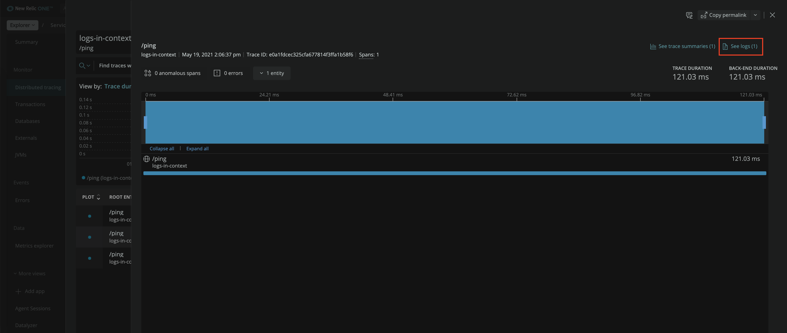
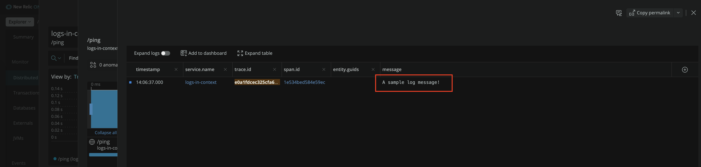

# Logs In Context With Log4j2

## Introduction

This project contains a Java application configured to use [Log4j2](https://logging.apache.org/log4j/2.x/) to export logs to New Relic via OTLP.

It uses the [OpenTelemetry Log4j2 Integration](https://github.com/open-telemetry/opentelemetry-java-instrumentation/tree/main/instrumentation/log4j/log4j-2.13.2/library) to inject trace context to Log4j2 [thread context](https://logging.apache.org/log4j/2.x/manual/thread-context.html), and to supply the `OpenTelemetryAppender`, which feeds Log4j2 logs through the OpenTelemetry SDK. 

Note, in order to use the `OpenTelemetryAppender` in your Log4j2 configuration, you'll need to include its package. For example, [log4j2.xml](src/main/resources/log4j2.xml) includes it via:
```
<Configuration status="WARN" packages="io.opentelemetry.instrumentation.log4j.v2_13_2">
  ...
</Configuration
```

## Run

Set the following environment variables:
* `NEW_RELIC_LICENSE_KEY=<your_license_key>`
  * Replace `<your_license_key>` with your [Account License Key](https://one.newrelic.com/launcher/api-keys-ui.launcher).
* Optional `OTLP_HOST=http://your-collector:4317`
  * The application is [configured](../shared-utils/src/main/java/com/newrelic/shared/OpenTelemetryConfig.java) to export to New Relic via OTLP by default. Optionally change it by setting this environment variable.
  
Run the application from a shell in the [java root](../) via:
```
./gradlew logs-in-context-log4j2:bootRun
```

Exercise logs in context by calling the `curl http://localhost:8080/ping`, which generates a log message inside the context of a trace:

Check New Relic to confirm that data is flowing.

_Trace With Logs_


_Trace Logs In Context_

