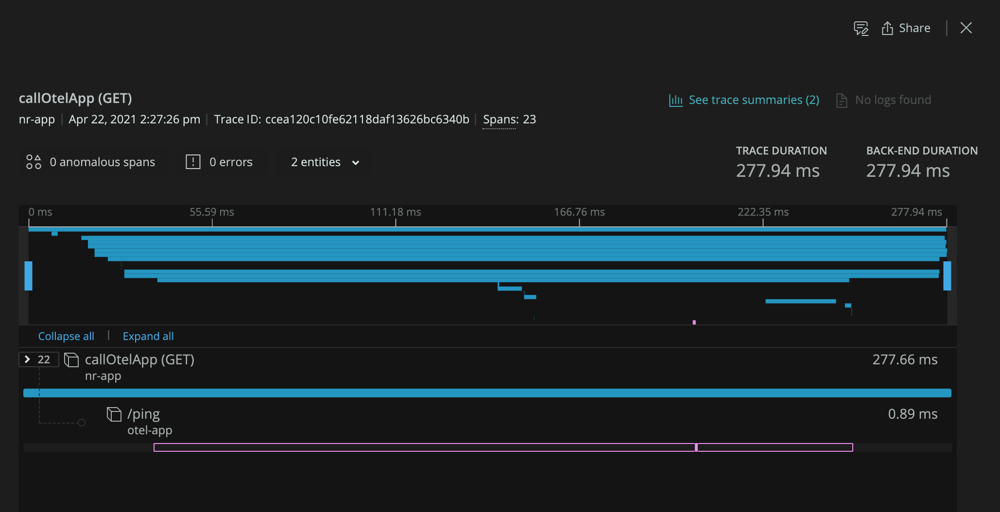
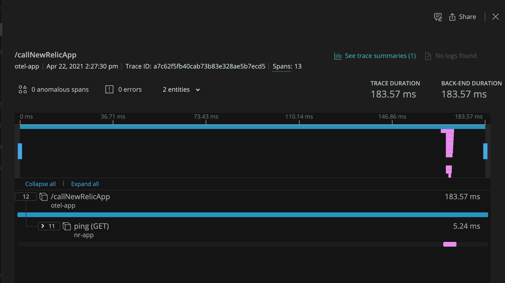

# OpenTelemetry with New Relic Distributed Tracing

## Introduction

This project demonstrates distributed tracing for two Java applications, one instrumented with OpenTelemetry, the other with the New Relic java agent. 

The project is composed of two modules:
- [nr-app](./nr-app): A simple Java application instrumented with the New Relic Java Agent running on `http://localhost:8081`.
- [otel-app](./otel-app): A simple Java application instrumented manually with the OpenTelemetry API running on `http://localhost:8080`.

Each application contains a simple `GET /ping` route, and a route to call the other application's `GET /ping` route. This allows distributed tracing to be demonstrated when originating from an OpenTelemetry instrumented application, and from a New Relic instrumented application. The routes are as follows:
- `GET http://localhost:8081/callOtelApp`: Return OpenTelemetry application's `GET /ping` at `GET http://localhost:8080/ping`
- `GET http://localhost:8080/callNewRelicApp`: Return New Relic application's `GET /ping` at `GET http://localhost:8081/ping`

Distributed trace context is propagated via [W3C Trace Context](https://www.w3.org/TR/trace-context/) headers in both directions.

## Run

The OpenTelemetry application is configured to export data via OTLP to a collector running at `http://localhost:4317`. This can be changed by specifying an alternative via `OTLP_HOST` environment variable:
```shell
export OTLP_HOST=http://my-collector-host:4317
```

For a real working example, you should run a collector instance locally via docker by following the [nr-otlp-export](../../collector/nr-otlp-export/README.md) example.

After running the collector, run both applications from a shell in the [java root](../) as follows. NOTE: you'll need to export your New Relic account license key as an environment variable for the New Relic application to run.
```shell
# Run the New Relic app in one shell
export NEW_RELIC_LICENSE_KEY=<INSERT_LICENSE_KEY_HERE>
./gradlew otel-nr-dt:nr-app:bootRun

# Run the OpenTelemetry app in a separate shell
./gradlew otel-nr-dt:otel-app:bootRun
```

To demonstrate distributed tracing, invoke each application:
```shell
# Distributed trace starts in New Relic application and makes external call to OpenTelemetry application
curl http://localhost:8081/callOtelApp

# Distributed trace starts in OpenTelemetry application and makes external call to New Relic application
curl http://localhost:8080/callNewRelicApp
```

You should see spans from the OpenTelemetry application show up in the collector logs. 

You should see distributed traces from both applications in your New Relic account that resemble:

*New Relic App Rooted Trace*


*OpenTelemetry App Rooted Trace*
