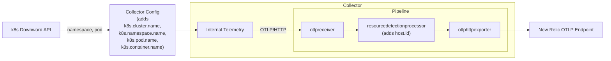

# Monitoring the OpenTelemetry Collector

The OpenTelemetry Collector can be configured to emit its [internal telemetry](https://opentelemetry.io/docs/collector/internal-telemetry/). This enables you to observe and monitor the health of your collectors. This example demonstrates how to configure the collector's internal telemetry and send it to New Relic to light up New Relic's collector observability experience. The example also demonstrates how to use the collector to instrument the host and container the collector is running on. As a result, relationships are created in New Relic between the collector and its host and container.

## Architecture



## Requirements

- You need to have a Kubernetes cluster, and the kubectl command-line tool must be configured to communicate with your cluster. This example was tested on [AWS EKS](https://aws.amazon.com/eks/) with Amazon Linux nodes. The steps for achieving a container relationship should be universal for all k8s clusters - they also work on local clusters like `kind` or `minikube`.
- Your infrastructure must be instrumented with one of our OTel infrastructure agents. We recommend using the [nr-k8s-otel-collector](https://github.com/newrelic/helm-charts/tree/master/charts/nr-k8s-otel-collector) helm chart which provides both container and host monitoring. 
- The host relationship is synthesized based on the `host.id` attribute matching up on the host and collector telemetry. The determination of this attribute heavily depends on your environment and is driven by the `resourcedetectionprocessor` which does not support local clusters out-of-the-box. You might be able to make it work by tweaking the processor configuration, but we won't cover this here as there are too many variables involved.
- [A New Relic account](https://one.newrelic.com/)
- [A New Relic license key](https://docs.newrelic.com/docs/apis/intro-apis/new-relic-api-keys/#license-key)

### Collector

We'll use [otelcol-contrib](https://github.com/open-telemetry/opentelemetry-collector-releases/tree/v0.142.0/distributions/otelcol-contrib) for the example but if you are using your own collector, here is the what and why regarding components:
- [otlpreceiver](https://github.com/open-telemetry/opentelemetry-collector/blob/v0.142.0/receiver/otlpreceiver/README.md) to provide a hook for the internal telemetry to get funnelled into a pipeline defined in the collector itself.
- [resourcedetectionprocessor](https://github.com/open-telemetry/opentelemetry-collector-contrib/tree/v0.142.0/processor/resourcedetectionprocessor) to add `host.id` to internal telemetry.
- [otlphttpexporter](https://github.com/open-telemetry/opentelemetry-collector/tree/v0.142.0/exporter/otlphttpexporter) to send telemetry to New Relic.
- (optional) [memorylimiterprocessor](https://github.com/open-telemetry/opentelemetry-collector/tree/v0.142.0/processor/memorylimiterprocessor) and [batchprocessor](https://github.com/open-telemetry/opentelemetry-collector/tree/v0.142.0/processor/batchprocessor) for best practices.

### Appendix

- Collector entity definition: [EXT-SERVICE](https://github.com/newrelic/entity-definitions/blob/main/entity-types/ext-service/definition.yml#L72-L94)
  - requires `service.name` on internal telemetry
- Collector to container relationship: [INFRA_KUBERNETES_CONTAINER-to-EXT_SERVICE](https://github.com/newrelic/entity-definitions/blob/main/relationships/synthesis/INFRA_KUBERNETES_CONTAINER-to-EXT_SERVICE.yml#L40)
  - requires `k8s.cluster.name`, `k8s.namespace.name`, `k8s.pod.name`, `k8s.container.name` on internal telemetry that matches
  equivalent attributes on the container telemetry.
- Collector to host relationship: [INFRA-HOST-to-EXT-SERVICE](https://github.com/newrelic/entity-definitions/blob/main/relationships/synthesis/INFRA-HOST-to-EXT-SERVICE.yml)
  - requires `host.id` on internal telemetry that matches the host telemetry.


## Running the example

1. Instrument your containers with [nr-k8s-otel-collector](https://github.com/newrelic/helm-charts/tree/master/charts/nr-k8s-otel-collector).
    ```shell
      # Cluster name is hard coded as the downward API does not expose it
      license_key='INSERT_API_KEY'
      cluster_name='INSERT_CLUSTER_NAME'
      helm repo add newrelic https://helm-charts.newrelic.com
      helm upgrade 'nr-k8s-otel-collector-release' newrelic/nr-k8s-otel-collector \
      --install \
      --version '0.9.8' \
      --create-namespace --namespace 'newrelic' \
      --dependency-update \
      --set "cluster=${cluster_name}" \
      --set "licenseKey=${license_key}"
    ```
1. Create your secrets file from the template and update the values:
    ```shell
    cp k8s/secrets.yaml.template k8s/secrets.yaml
    # Edit k8s/secrets.yaml with your actual API key and cluster name
    ```
    * Make sure that the cluster name matches the value above and, if you have multiple accounts, that the license key reports to the same account.

1. Deploy the collector, see `collector.yaml` - we're using [contrib](https://github.com/open-telemetry/opentelemetry-collector-releases/tree/v0.142.0/distributions/otelcol-contrib) as an example.

    ```shell
    kubectl apply -f k8s/
    ```
   
1. When finished, cleanup resources with the following command. This is also useful to reset if modifying configuration.

   ```shell
   kubectl delete -f k8s/
   helm uninstall 'nr-k8s-otel-collector-release' --namespace 'newrelic'
   ```

## Viewing your data

### In the UI

The infrastructure relationships are used to light up our APM UI. Navigate to "New Relic -> All Entities -> Services - OpenTelemetry" and click on the service with name corresponding to value provided in `secrets.yaml` for `COLLECTOR_SERVICE_NAME`. The 'Summary' page shows metrics related to the infrastructure entities related to your collector at the bottom of the page.

### From the CLI
You can also query the relationships through NerdGraph using the [newrelic CLI](https://github.com/newrelic/newrelic-cli/blob/main/docs/GETTING_STARTED.md#environment-setup). Note that the api key in this case is NOT an ingest key (as used above), but instead a user key.

The following script should work if your service name is sufficiently unique as the first part determines the entity guid based on the service name.
If you have the correct entity guid, you can skip the first part and just query the relationships directly.

```bash
#!/bin/bash
export NEW_RELIC_REGION='US'
export NEW_RELIC_API_KEY='INSERT_USER_KEY'
SERVICE_NAME='INSERT_SERVICE_NAME'

ENTITY=$(newrelic nerdgraph query "{
  actor {
    entitySearch(queryBuilder: {name: \"${SERVICE_NAME}\"}) {
      results {
        entities {
          guid
          name
        }
      }
    }
  }
}")
SERVICE_ENTITY_GUID=$(jq -r '.actor.entitySearch.results.entities[0].guid' <<< "$ENTITY")

newrelic nerdgraph query "{
  actor {
    entity(guid: \"${SERVICE_ENTITY_GUID}\") {
      relatedEntities(filter: {relationshipTypes: {include: HOSTS}}) {
        results {
          source {
            entity {
              name
              guid
              domain
              type
            }
          }
          type
          target {
            entity {
              guid
              name
            }
          }
        }
      }
    }
  }
}" 
```