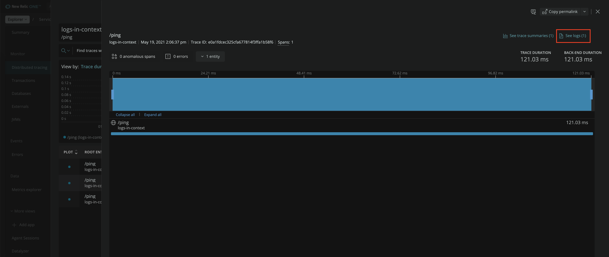
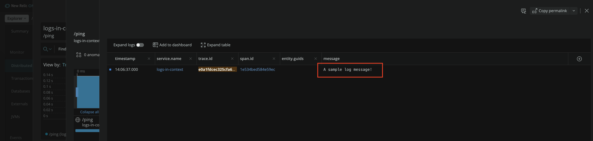

# Logs In Context With Log4j2

## Introduction

This project contains a Java application configured to use [Log4j2](https://logging.apache.org/log4j/2.x/) to write JSON structured logs that propagate OpenTelemetry trace context onto log messages. It also contains a [docker-compose.yaml](./docker-compose.yaml) which illustrates how to forward these logs to an OpenTelemetry Collector, and onto New Relic.

The [log4j2.xml](./log4j2.xml) configures the application to log out to the console with a [JSON Template Layout](https://logging.apache.org/log4j/2.x/manual/json-template-layout.html) defined in [Log4j2EventLayout.json](./Log4j2EventLayout.json).

The application uses the [OpenTelemetry Log4j2 Integration](https://github.com/open-telemetry/opentelemetry-java-instrumentation/tree/main/instrumentation/log4j/log4j-context-data/log4j-context-data-2.17/library-autoconfigure) to inject trace context to Log4j2 [thread context](https://logging.apache.org/log4j/2.x/manual/thread-context.html).

The result is JSON structured logs, with one JSON object per line, which have the `span_id` and `trace_id` from OpenTelemetry included:

```json
{
  "timestamp": "2021-05-19T15:51:16.063-05:00",
  "thread.name": "http-nio-8080-exec-1",
  "log.level": "INFO",
  "logger.name": "...",
  "message": "...",
  "trace_id": "6aae93314fe034149cd85f07eac24bc5",
  "span_id": "f1be31bc6e4471d8",
  "service.name": "logs-in-context"
}
```

The OpenTelemetry Log specification defines that when propagating [trace context in legacy formats](https://github.com/open-telemetry/opentelemetry-specification/blob/main/specification/compatibility/logging_trace_context.md), `trace_id` and `span_id` should be used. However, [New Relic structured logging conventions](https://github.com/newrelic/newrelic-exporter-specs/tree/master/logging) expect trace context to be propagated as `trace.id` and `span.id`. The [transform](https://github.com/open-telemetry/opentelemetry-collector-contrib/tree/main/processor/transformprocessor) processor is defined in the collector config to replace `trace_id` => `trace.id`, and `span_id` => `span.id`. Alternatively, this mapping could be done in the [Log4j2 JSON layout](./Log4j2EventLayout.json), which may be more performant.

## Run

The application runs with Docker. The [docker-compose.yaml](./docker-compose.yaml) contains service definitions for the application and an [OpenTelemetry Collector](https://opentelemetry.io/docs/collector/). The application is configured to use the [Fluentd logging driver](https://docs.docker.com/config/containers/logging/fluentd/) to forward logs the collector. The collector is configured to receive Fluentd logs and forward them to New Relic over OTLP.

The following image illustrates a similar example using FluentBit:


Next, build and run the application:

```shell
// Export your New Relic API key as an environment variable
export NEW_RELIC_API_KEY=<INSERT-API-KEY-HERE>

// Build and run the application
docker compose up --build
```

Navigate to the app in a browser at `http://localhost:8080`. 

To exercise such that a trace is committed with logs in context, navigate to `http://localhost:8080/oups`.

You should be able to see a mix of trace and log data flowing through the collector. If you navigate to the distributed traces of the application in [New Relic One](https://one.newrelic.com/), you should be able to find traces related to the call to `GET /oups`, and see the logs in context:

_Trace With Logs_


_Trace Logs In Context_

