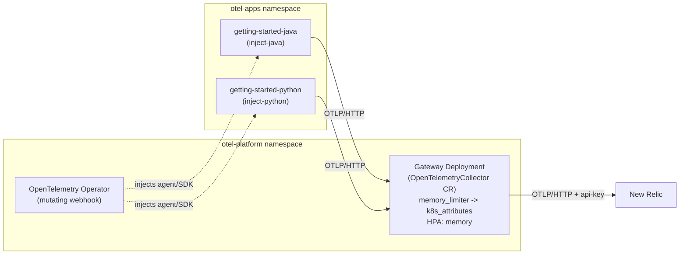

# OpenTelemetry Operator: auto-instrumentation + Collector Gateway on Kubernetes

This example demonstrates a centrally-managed OpenTelemetry platform pattern on Kubernetes:
the [OpenTelemetry Operator](https://opentelemetry.io/docs/platforms/kubernetes/operator/) auto-injects per-language instrumentation into application pods via an `Instrumentation` custom resource, while a Collector Gateway deployed via an `OpenTelemetryCollector` custom resource aggregates, enriches and exports every signal to New Relic.
Credentials live only on the Gateway, never on the `Instrumentation` resource or on any application pod.

It deploys two of the [getting-started-guides](../../getting-started-guides) apps ([Java](../../getting-started-guides/java) and [Python](../../getting-started-guides/python)) both relying purely on Operator-injected auto-instrumentation, with **no** instrumentation of their own baked in.
Each is built from a purpose-built Dockerfile in [`apps/`](./apps) that keeps the original app source but drops the getting-started-guides image's own SDK setup (Java's bundled agent, Python's `opentelemetry-instrument` wrapper), so the Operator's webhook is the only thing instrumenting them.

Everything lives in one of two namespaces: **`otel-platform`** (the Operator, the `Instrumentation`/`OpenTelemetryCollector` custom resources, and the Gateway they produce) and **`otel-apps`** (just the application Deployments).



## Requirements

* [Docker](https://docs.docker.com/get-docker/)
* [kind](https://kind.sigs.k8s.io/)
* [kubectl](https://kubernetes.io/docs/tasks/tools/#kubectl)
* [Helm](https://helm.sh/docs/intro/install/)
* [GNU Make](https://www.gnu.org/software/make/)
* [A New Relic account](https://one.newrelic.com/)
* [A New Relic license key](https://docs.newrelic.com/docs/apis/intro-apis/new-relic-api-keys/#license-key)

## Running the example

All commands run from this directory. Every target in the [`Makefile`](./Makefile) points its `kubectl`/`helm` calls at this cluster explicitly via `--context`/`--kube-context kind-nr-operator-demo`, so your default kubeconfig context is never touched and there's no ambiguity about which cluster any command targets, however many other clusters you also have configured.

1. Create the kind cluster:

    ```shell
    make cluster
    ```

2. Create your secrets file from the template and fill in your New Relic license key -- `make install` (next step) checks for this file and fails fast with a reminder if it's missing:

    ```shell
    cp manifests/01-secrets.yaml.template manifests/01-secrets.yaml
    # Edit manifests/01-secrets.yaml with your New Relic license key
    ```

    * If your account is based in the EU, update `NEW_RELIC_OTLP_ENDPOINT` to `https://otlp.eu01.nr-data.net`.

3. Install the Metrics Server, the OpenTelemetry Operator, and the platform's namespaces/secret/RBAC/`OpenTelemetryCollector`/`Instrumentation` CRs (all in `otel-platform`):

    ```shell
    make install
    ```

    * The Operator is installed with its built-in self-signed certificate generation for its admission webhook, so no [cert-manager](https://cert-manager.io/docs/) dependency is required. Its mutating webhook watches Pod creation across the *whole* cluster, not just its own namespace -- so apps in `otel-apps` still get instrumented normally even though the Operator itself runs in `otel-platform`.
    * This target waits for the Operator and then the Gateway to become available before returning, since applying annotated pods before the webhook is ready makes injection silently no-op (the webhook's `failurePolicy` for pods is `Ignore`) rather than block pod creation, which is confusing to debug.
    * If `otel-gateway-collector` crash-loops instead of becoming available, check its logs first -- the most common cause is `spec.image` on the CR not pointing at an image that includes the `k8s_attributes` processor, since it isn't in the operator's default core-only image.
    * Confirm the HPA came up too: `kubectl --context kind-nr-operator-demo get hpa -n otel-platform` should show an `otel-gateway-collector` entry with a non-`<unknown>` memory target once the Metrics Server has scraped at least once.

4. Build the two app images and load them into the kind cluster:

    ```shell
    make build
    ```

5. Deploy the apps:

    ```shell
    make deploy
    ```

    * To confirm auto-injection actually happened, `kubectl --context kind-nr-operator-demo describe pod -n otel-apps -l app=getting-started-java` (or `-python`) should show an `opentelemetry-auto-instrumentation-java` (or `-python`) init container.

6. When finished, clean up by deleting the whole cluster:

    ```shell
    make clean
    ```

## Viewing your data

Port-forward each app's Service and hit the `/fibonacci` endpoint to generate some telemetry:

```shell
kubectl --context kind-nr-operator-demo port-forward -n otel-apps svc/getting-started-java 8081:8080 &
kubectl --context kind-nr-operator-demo port-forward -n otel-apps svc/getting-started-python 8082:8080 &

curl 'http://localhost:8081/fibonacci?n=10'
curl 'http://localhost:8082/fibonacci?n=10'
```

To generate a continuous stream instead of one-off requests, run [`scripts/generate-load.py`](./scripts/generate-load.py) (adapted from [getting-started-guides](../../getting-started-guides)'s own load generator) while the two port-forwards above are still running -- it hits both apps with a random `n` once a second until you `Ctrl-C` it:

```shell
./scripts/generate-load.py
```

Then, in New Relic, use the following NRQL query to verify data is flowing from both apps:

```
FROM Span, Metric, Log
SELECT
  filter(count(*), WHERE eventType() = 'Log') as 'log_record_count',
  filter(count(*), WHERE eventType() = 'Metric') as 'metric_point_count',
  filter(count(*), WHERE eventType() = 'Span') as 'span_count'
WHERE service.name IN ('getting-started-java', 'getting-started-python')
FACET service.name SINCE 10 minutes ago
```

Both services' spans/logs/metrics should carry `k8s.pod.name`, `k8s.namespace.name` and `k8s.deployment.name` attributes, added centrally by the Gateway's `k8s_attributes` processor.

You should also see `k8s.cluster.name`, `deployment.environment.name` differ between the two services (`development` for Java (the platform default) and `staging` for Python), and `tags.team=my-team` present only on Python's telemetry and as a New Relic Entity tags (an attribute the platform never set at all):

```
FROM Span
SELECT latest(deployment.environment.name), latest(tags.team)
WHERE service.name IN ('getting-started-java', 'getting-started-python')
FACET service.name SINCE 10 minutes ago
```

You can also navigate to "New Relic -> All Entities -> Services - OpenTelemetry" to see each app as its own entity, and check the Gateway's own health under "Collector" telemetry once its internal metrics are exported.

The Gateway pushes its own operational metrics via a separate OTLP path (`service.telemetry` in `03-collector.yaml`), reported under `service.name = 'otel-gateway-collector'`.
Once you've sent a bit of traffic, check its queue depth and export failures:
